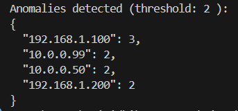

# Security Monitoring System (Python SIEM)

**Production SIEM** parsing authentication logs, detecting brute‑force attacks, and supporting multiple log formats with timezone normalization.

## ✨ Features

- **Multi‑format parsing**: SSH syslog + CSV/ISO + Splunk auth logs
- **Brute‑force detection**: Configurable threshold + sliding time window (120s default)
- **Timezone‑aware analysis**: IST/MYT/SGT/PST via `config.json` timezone_table
- **Multi‑source**: Automatically combines all `.txt` log files
- **Production output**: JSON alerts + CLI dashboard
- **File integrity**: SHA256 verification (future)

## 📊 Live Demo

**Multi‑format SIEM: SSH syslog + CSV/ISO → 16 events analyzed**



## 🛠 Technologies
- **Python 3.9+**
- Regular expressions (universal log parsing)
- `datetime` + timezone normalization
- JSON configuration (`config.json` rules + timezone_table)
- `collections.defaultdict` (IP tracking)

## 🚀 Quick Start
```bash
python main.py
```

## 📈 Key Features:
✅ Auth log parsing (failed/success, sudo)  
✅ Brute-force detection by IP (2+ failures)  
✅ SHA256 file integrity checks  
✅ JSON-based rules and settings  
✅ Minimal CLI tool, no external deps  

## config.json timezone_table:
```json
{
  "IST": "+05:30", "MYT": "+08:00", "SGT": "+08:00", 
  "PST": "-08:00", "UTC": "+00:00", "CET": "+01:00"
}
